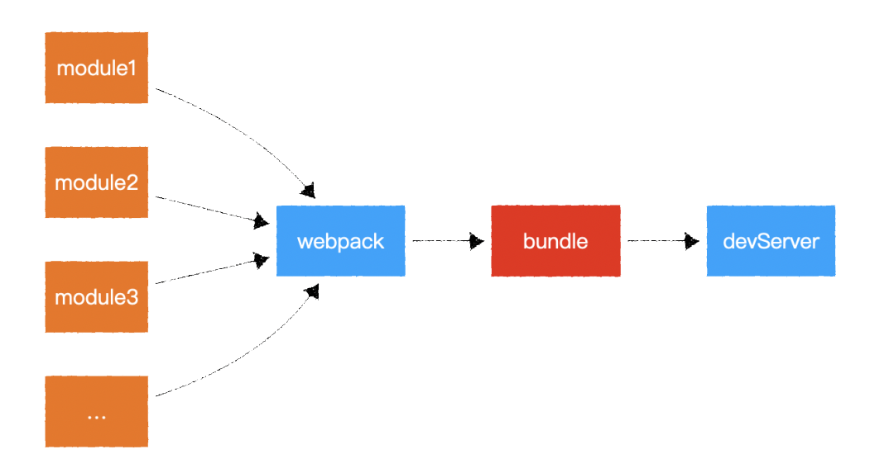
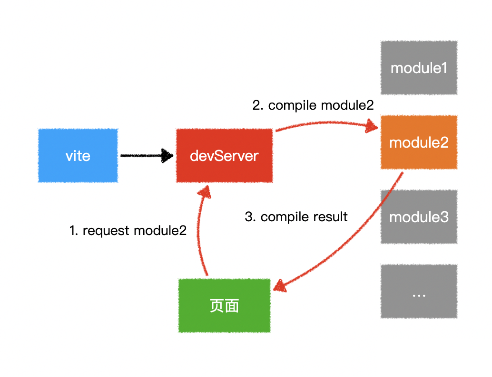

## 前言

webpack构建的vue2.X 项目由于业务扩展越来越大，导致项目在本地编译时热更新很慢，页面更新需要时间太长。为提高团体开发速度和效率，将底部打包构建的环境由webpack迁移为vite。

>     兼容性注意 
    Vite 需要 Node.js 版本 >= 12.0.0。
    chrome 需要 63及以上

## 为什么 Vite 启动这么快

- 底层实现上，Vite 是基于 esbuild 预构建依赖的
- esbuild 使用 go 编写，并且比以 js 编写的打包器预构建依赖, 快 10 - 100 倍。 因为 js 跟 go 相比实在是太慢了，js 的一般操作都是毫秒计，go 则是纳秒
- 两者的启动方式也有所差异

## webpack启动方式

Webpack 会先打包，然后启动开发服务器，请求服务器时直接给予打包结果。



## vite启动方式

Vite 是直接启动开发服务器，请求哪个模块再对该模块进行实时编译。



## webpack如何升级为vite

- vue3.x中webpack迁移vite，主要借助wp2vite脚手架，改造过程中也会遇到很多问题，可参考这篇博文 [项目 Webpack 转 Vite 实战](https://blog.csdn.net/qianyu6200430/article/details/117677574)
- vue2.x中webpack转vite, 主要借助 vite-plugin-vue2插件，具体可参考 [Vue2老项目使用vite2升级](https://juejin.cn/post/6997310696845213704)

## 改造流程
1. 新建vite.config.js
2. 安装相关包
3. 修改入口文件
4. 删除webpack相关配置及依赖
5. 环境变量的修改

## 项目改造中遇到的坑

1. 打包多页面配置，及打包后页面路径的修改；
 > 目前没有插件实现，参考别人的插件，自己写插件通过虚拟html的方式实现
2. 文件引入省略后缀名

```javascript
resolve: {
  extensions: ['.vue']
}
```
3. @别名的使用，修改相对路径地址

```javascript
alias: {
  '@': path.resolve(__dirname, 'src')
}
```
4. sass语言的扩展，安装sass

css 深度选择器`/deep/`写法改为`::v-deep`，vite中不支持`/deep/`书写形式

5. element主题引用修改，css变量文件预加载

```css
//$--font-path: '~element-ui/lib/theme-chalk/fonts';
//@import "~element-ui/packages/theme-chalk/src/index";

// 上面 提示文件找不到 改为

$--font-path: 'node_modules/element-ui/lib/theme-chalk/fonts';
@import "node_modules/element-ui/packages/theme-chalk/src/index";
```


```javascript
css：{
  preprocessorOptions: {
    scss: {
      additionalData: `@import "@/style/sass1.scss";@import "@/style/sass2.scss";`
    }
  }
}
```

6. webpack中使用require引入文件， 但vite中需要改成 important 引入

因为vite的底层有使用到Rollup组件打包，但Rollup不支持common.js语法风格，所以需要改成esModule语法才能正确编译；vite.config.js 中 optimizeDeps 也是此原理；目前社区中大部分模块都没有设置默认导出 esm，而是导出了 cjs 的包，目前在 vite 项目里直接使用 lodash 之类的包会报错；

> optimize 命令专门为解决模块引用的坑而开发；将原来common.js语法转译为esm风格的语法供vite使用(有待验证)

```javascript
optimizeDeps: {
  // @iconify/iconify: The dependency is dynamically and virtually loaded by @purge-icons/generated, so it needs to be specified explicitly
  include: [
    '@iconify/iconify',
    'ant-design-vue/es/locale/zh_CN',
    'moment/dist/locale/zh-cn',
    'ant-design-vue/es/locale/en_US',
     'moment/dist/locale/eu',
  ],
  exclude: ['vue-demi'],
}
```

7. svg字体图标的批量导入变更

webpack环境下，利用`require.context`批量导出

```javascript
const req = require.context('./svg', false, /.svg$/)
const requireAll = requireContext => requireContext.keys().map(requireContext)
requireAll(req)
```

Vite 支持使用特殊的 `import.meta.glob` 函数从文件系统导入多个模块：

```javascript
const modules = import.meta.glob('./dir/*.js')
```

8. vite默认只支持`template`模板渲染，不支持`render(h, context) {}`渲染；

template----html的方式做渲染

render----js的方式做渲染

解决方式： 

(1) 将render渲染写法改为template渲染写法

(2)通过扩展vite插件Plugin 转译

9. build编译后，vendor.js入口文件打包过大；

可通过cdn方式引入业务所需组件，如：Vue、ElementUI、moment、ECharts、tinymce、axios 等

然后通过 viteExternalsPlugin 插件排除以上组件的打包，以减小构建生成包的体积；

界面上则通过 window 对象获取各组件实例

除viteExternalsPlugin组件+ index.html中script引入外， 还可以通过扩展vite-plugin-cdn插件 + 修改vite.config.js文件中 rollup配置来实现排除打包。

10. build编译后，有css文件 warning: “@charset” must be the first rule in the file，目前还没排查出具体问题，暂时只是警告，不影响项目正常运行。[详细内容 ](https://github.com/element-plus/element-plus/issues/3219)

11. 全局模块的移入，如jquery,lodash等

webpack: 

```javascript
plugin: [
  new webpack.ProvidePlugin({
    $: 'jquery',
    jQuery: 'jquery',
    'window.jQuery': 'jquery',
    _: 'ladash'
  })
]
```

vite: 

```javascript
define: {
  $: 'jquery',
  jQuery: 'jquery',
  'window.jQuery': 'jquery',
  _: 'ladash'
}
```

12. 待添加...

